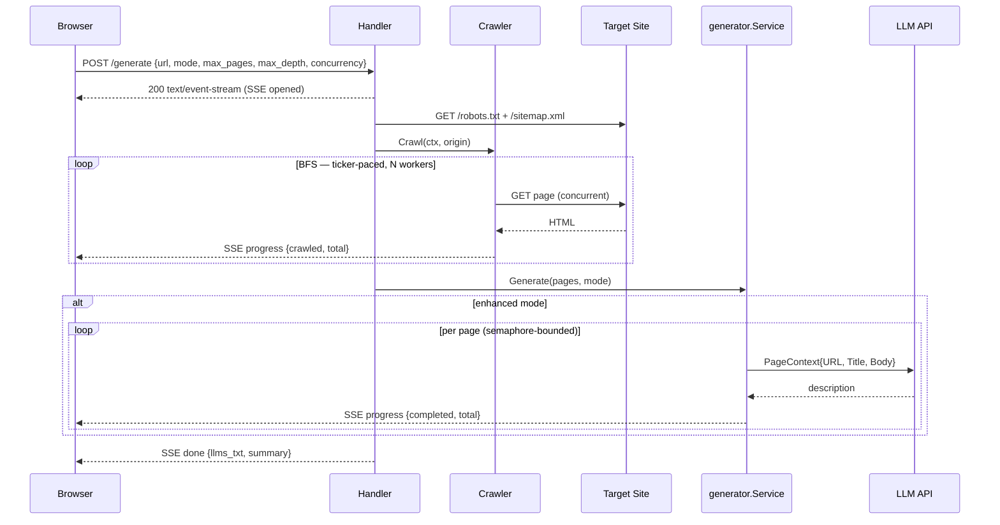

# llms.txt Generator — Design & Architecture

## 1. Overview

Crawls any website and generates a spec-compliant [`llms.txt`](https://llmstxt.org) file — the proposed standard for helping LLMs understand and navigate site content, analogous to `robots.txt` for crawlers.

Directly relevant to Profound: `llms.txt` is one of the primary signals shaping how AI interfaces like ChatGPT and Perplexity discover and represent a brand.

Two modes:
- **Basic** — uses `<meta name="description">` tags. Fast, no API key. Breaks on sites without meta tags.
- **Enhanced** — same crawl, LLM-generated descriptions from page body. Required for doc-heavy sites.

---

## 2. Architecture

Single Go binary. Frontend is embedded via `//go:embed` and served directly — no build step, no separate server, one binary to deploy.

```
llm-txt/
├── main.go                  # env loading, dependency wiring, graceful shutdown
├── server/                  # Chi router, /generate handler, SSE streaming, password gate
├── services/generator/      # crawl → describe → format pipeline
├── crawler/                 # concurrent BFS, robots.txt, sitemap, HTML extraction
├── clients/llm/             # Anthropic/OpenAI client, semaphore-bounded pool
└── static/index.html        # embedded single-page frontend, vanilla JS + SSE
```

**SSE over WebSockets** — generation is unidirectional. SSE is simpler, works over plain HTTP/1.1, no extra infrastructure.

**Vanilla JS** — single HTML file, no build toolchain. A framework would add more complexity than it removes for a tool this focused.

### Data Flow



---

## 3. Crawler Design

**Sitemap seeding** — seeds the queue from `sitemap.xml` before BFS. Captures pages not linked from the homepage. Falls back to BFS-only if no sitemap exists.

**Canonical origin resolution** — follows redirects on the bare domain before crawling. `example.com → www.example.com` is common; without this, sitemap seeds fail the same-host check and get discarded. Surfaced as a real bug early on.

**Ticker-paced rate limiting** — a single `time.Ticker` shared across all workers gates dispatch at `1 / CRAWL_DELAY_MS`. `time.Sleep` per worker gives inconsistent per-domain rates under concurrency.

**Crawl speed as named levels** rather than raw numbers:

| Level | Workers | Delay |
|---|---|---|
| Standard | 1 | 500ms |
| Fast | 3 | 200ms |
| Turbo | 5 | 100ms |

**URL normalization** — strips fragments, `.html` suffixes, trailing slashes; skips pagination, tag archives, binary assets, off-domain redirects.

---

## 4. Basic vs Enhanced

Basic reads `<meta name="description">` directly — zero cost, zero latency. Enhanced sends each page's URL, title, and body (capped at 3000 chars) to the LLM:

> *Write a single short sentence (under 15 words) describing what this page covers. Noun phrase or verb-first style. Do not start with "This page". Reply with only the description.*

Descriptions are generated concurrently via a semaphore-bounded pool (`LLM_CONCURRENCY`, default 5).

---

## 5. Eval Framework

Standalone CLI (`tools/eval`) to measure output quality objectively. Three tiers:

- **Heuristics** (free) — mean description word count, "This page..." prefix rate, blank rate, unique rate, section count. Side-by-side basic vs enhanced. Useful as a regression check.
- **Ground truth** — fetches a site's published `llms.txt`, scores URL coverage, section alignment, false positives.
- **LLM-as-judge** (optional, costs money) — samples up to 20 overlapping pages, asks the LLM which description is more useful.

### Results

| Site | Pages | Crawl | GT Entries | Coverage | Notes |
|---|---|---|---|---|---|
| hono.dev | 27 | 1.9s | 86 | 29% | No meta tags — basic unusable |
| stripe.com | 129 | 30.5s | 268 | 9% | Rate limited before cap |
| vercel.com | 150 | 28.4s | 571 | 0% | Pure scale gap |
| supabase.com | 150 | 11.9s | 8 | 0% | GT is hand-curated (8 entries) |
| svelte.dev | 150 | 11.5s | 7 | 0% | GT is hand-curated (7 entries) |
| linear.app | 150 | 21.4s | 134 | 0% | GT likely on a different subdomain |
| shopify.com | 150 | 48.0s | 9 | 33% | Slowest crawl; GT hand-curated |

**Enhanced wins on every site.** Word count: 20–166 (basic) → 10–16 (enhanced). Uniqueness: 99–100% enhanced vs as low as 13% basic. Svelte is the extreme case — basic produces 166-word wall-of-text descriptions at 13% unique; enhanced: 10.6 words, 100% unique.

**Two GT philosophies.** Sparse/hand-curated (Supabase: 8, Svelte: 7, Shopify: 9) — our comprehensive output looks like false positives but is more thorough. Exhaustive (Vercel: 571, Stripe: 268) — low coverage is a scale story, not quality failure.

**Coverage needs context.** Only meaningful when crawl cap ≥ GT size and both index the same URL space.

---

## 6. Security & Access

Simple password gate: `POST /password/check` compares against `APP_PASSWORD` (default: `profound`). Every `/generate` call sends it as `X-Password`.

Intentionally minimal — plaintext comparison, no rate limiting. Right level of friction for a demo deployment. Bcrypt and rate limiting would be the next step for a public product.

---

## 7. Tradeoffs & Limitations

**JS-rendered sites** — crawler only follows `<a href>` in raw HTML. elysiajs.com: 1 page crawled vs 94-entry published `llms.txt`. Fixing it requires a headless browser (chromedp), which adds significant complexity and per-request resource cost.

**Section inference vs. intent** — sections derived from URL path segments reflect structure, not meaning. Hand-curated `llms.txt` sections reflect product intent. These diverge on product sites and can't be reconciled without input from the site owner.

**Crawl cap** — 50-page default keeps requests fast. For large sites the output is a representative sample. UI exposes up to 200 pages.

---

## 8. Development Process

`_dev/` contains design documents written before building each feature — concurrent crawling, eval framework, observability, crawl stats. I used Claude Code as a thinking partner: drafting designs, reviewing tradeoffs, writing code — but owning the architectural decisions.

Features were designed before they were built. The ones that didn't make the cut are documented with a rationale, not just absent.

---

## 9. What I'd Build Next

- **Prometheus metrics** — request count, latency by mode, LLM error rate, pages crawled. Design is in `_dev/metrics.md`; cut for time.
- **Crawl stats in UI** — pages fetched vs. skipped, total duration, sitemap-seeded flag. Design in `_dev/crawl-stats-summary.md`.
- **JS rendering warning** — detect low page yield relative to sitemap size and surface a note in the UI.
- **Rate limiting on `/password/check`** — prevent brute force.
