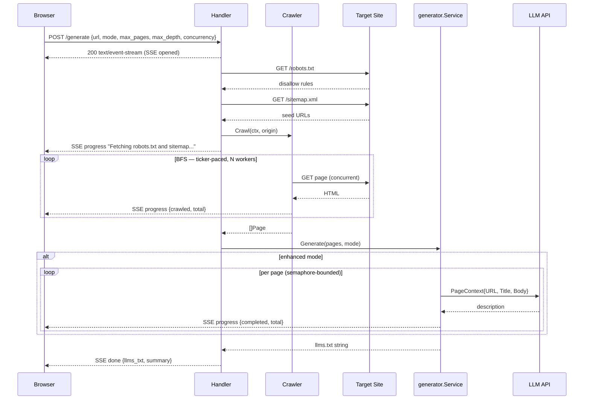

# llms.txt Generator

A web app that crawls any website and generates an [`llms.txt`](https://llmstxt.org) file — a proposed standard that helps LLMs understand and navigate site content, similar to how `robots.txt` guides crawlers.

Enter a URL, pick a mode, and get a ready-to-publish `llms.txt` in seconds. Generation progress streams live to the UI via SSE, including a real-time progress bar.

## Setup

**Prerequisites:** Go 1.26+

```bash
git clone https://github.com/noahschumacher/llm-txt
cd llm-txt

cp .env.example .env
# edit .env — at minimum set APP_ENV and APP_PORT

make run
```

Open `http://localhost:8080`.

### Building

```bash
make build
LLM_TXT_ENV_FILE=.env ./bin/llm-txt
```

The binary is fully self-contained — the frontend is embedded via `//go:embed`.

## Configuration

| Variable | Description | Required |
|---|---|---|
| `APP_ENV` | `local` \| `dev` \| `prod` | Yes |
| `APP_PORT` | Port to listen on | Yes |
| `APP_PASSWORD` | Plaintext password gate (default: `profound`) | No |
| `LLM_PROVIDER` | `anthropic` \| `openai` | Enhanced mode only |
| `LLM_API_KEY` | API key for the LLM provider | Enhanced mode only |
| `LLM_MODEL` | Model to use (e.g. `claude-haiku-4-5`, `gpt-4o-mini`) | No |
| `CRAWL_MAX_PAGES` | Max pages to crawl per request (default: `50`) | No |
| `CRAWL_MAX_DEPTH` | Max BFS depth (default: `3`) | No |
| `CRAWL_DELAY_MS` | Delay between requests in ms (default: `500`) | No |
| `CRAWL_CONCURRENCY` | Server-side crawl worker default (default: `1`) | No |
| `LLM_CONCURRENCY` | Max concurrent LLM calls (default: `5`) | No |

Crawl speed can also be set per-request from the UI (Standard / Fast / Turbo), overriding the server default.

## Eval CLI

`tools/eval` scores generated output against heuristics and optionally a site's published `llms.txt`.

```bash
# heuristics only — basic vs enhanced side-by-side
make eval ARGS="--url https://hono.dev"

# + ground truth comparison
make eval ARGS="--url https://hono.dev --ground-truth https://hono.dev/llms.txt"

# + LLM-as-judge (costs money, samples up to 20 overlapping pages)
make eval ARGS="--url https://hono.dev --ground-truth https://hono.dev/llms.txt --llm-judge"

# save report
make eval ARGS="--url https://hono.dev --out tools/eval/_reports/hono.md"
```

**Heuristics** (always run, no API key needed): mean description word count, "This page..." prefix rate, blank descriptions, unique description rate, section count — reported side-by-side for basic and enhanced.

**Ground truth** (when `--ground-truth` passed): URL coverage, section alignment, false positives against the site's own published `llms.txt`.

See `tools/eval/findings.md` for results from real runs.

---

## Deployment (Sevalla)

1. Connect your GitHub repo in the Sevalla dashboard
2. Build command: `go build -o bin/llm-txt .`
3. Start command: `./bin/llm-txt`
4. Add environment variables under Settings → Environment Variables

Sevalla handles HTTPS termination — no additional config needed.

---

## How It Works

### Generation Modes

**Basic** — Uses page titles and `<meta name="description">` for descriptions. Fast, no API key required.

**Enhanced** — Same crawl, but descriptions are generated by an LLM from page body content, seeded with the page's URL and title for richer context. Produces meaningfully better output. Requires a configured API key.

### Data Flow



### Pipeline

1. Validate and normalize the URL to its origin (scheme + host); follow any redirect to resolve the canonical host (e.g. `example.com → www.example.com`) so sitemap seeds and host comparisons are consistent
2. Fetch and parse `robots.txt` — build a disallow list respected throughout the crawl
3. Fetch `sitemap.xml` (follows `sitemapindex` if present) to seed the queue; falls back to BFS from root
4. Concurrent BFS crawl up to `CRAWL_MAX_PAGES` pages at `CRAWL_MAX_DEPTH` levels — a ticker-paced dispatcher fans work out to N workers; each worker extracts `<title>`, `<meta name="description">`, body text, and outbound links; skips `<nav>`, `<header>`, `<footer>`, `<aside>`, `<script>`, `<style>`; filters pages that redirected off-domain
5. Normalize and deduplicate URLs — strip fragments, `.html` suffixes, trailing slashes; skip pagination, tag archives, binary assets, issue trackers, and other non-content paths
6. **Basic mode:** use meta descriptions as-is. **Enhanced mode:** call `llm.DescribeAll` — each page's URL, title, and body are sent to the LLM; results returned in input order via a semaphore-bounded goroutine pool
7. Infer sections from the first URL path segment (`/docs/*` → Docs, `/blog/*` → Blog, etc.)
8. Assemble `llms.txt` per spec: `# site`, blockquote description from the root page, `## Section` headers, `- [Title](url): Description` entries
9. Stream all progress events (crawl count, description count, progress bar) to the client via SSE; deliver the final output in the `done` event

### Architecture

Single Go binary — no separate frontend server or build step. The `static/` directory is embedded at compile time.

```
llm-txt/
├── main.go                  # env loading, dependency wiring, graceful shutdown
├── server/
│   ├── server.go            # server struct, route registration
│   ├── generate.go          # /generate handler, SSE streaming
│   ├── password.go          # /password/check handler
│   └── middleware/
│       ├── log.go           # request logging
│       └── timeout.go       # per-route timeout
├── services/
│   └── generator/           # crawl → describe → format pipeline
├── crawler/
│   ├── crawler.go           # Crawler struct, concurrent BFS dispatcher
│   ├── robots.go            # robots.txt fetch and parse
│   ├── sitemap.go           # sitemap.xml / sitemapindex parse
│   ├── extractor.go         # HTML → title, meta description, body text, links
│   └── url.go               # resolveLink, sameHost, normalizeURL
├── clients/
│   └── llm/
│       ├── client.go        # Anthropic/OpenAI clients, PageContext, prompt
│       └── pool.go          # semaphore-bounded concurrent describe pool
├── pkg/
│   └── env.go               # LoadStringEnv, LoadIntEnv helpers
├── static/
│   └── index.html           # single-page frontend, vanilla JS + SSE
└── .env.example
```
